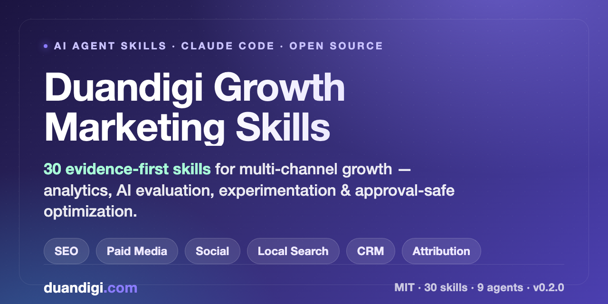

# Duandigi Growth Marketing Skills

<p align="center">
  
</p>

[](https://agentskills.io/)
[](https://code.claude.com/docs/en/skills)
[](LICENSE)
[](CHANGELOG.md)

> **Evidence-first AI Agent Skills for growth marketing.** A pack of **31 portable skills** that give an AI agent a complete operating cycle for **multi-channel marketing analytics** — SEO, paid media, social, email/lifecycle, local search, and CRM — plus secure account integration, AI evaluation, experimentation, and approval-safe optimization. Runs in **Claude Code** and any Agent Skills–compatible client.

Built for growth marketers, SEO specialists, performance marketers, agencies, and SaaS founders who want an AI agent that reasons from **evidence, confidence, and lineage** — not guesswork.

[Đọc README tiếng Việt »](README.vi.md)

---

## Contents

- [Why Duandigi Growth Marketing Skills](#why-duandigi-growth-marketing-skills)
- [Who it is for](#who-it-is-for)
- [The 31 skills](#the-31-skills)
- [How it works](#how-it-works)
- [Install in Claude Code](#install-in-claude-code)
- [Quick start — run the demo](#quick-start--run-the-demo)
- [Use cases](#use-cases)
- [Security and safety model](#security-and-safety-model)
- [FAQ](#faq)
- [About the author — Duan Digi](#about-the-author--duan-digi)
- [Contributing and community](#contributing-and-community)
- [License](#license)

---

## Why Duandigi Growth Marketing Skills

Growth teams drown in disconnected dashboards, mismatched metric definitions, and AI tools that sound confident but skip the evidence. This project gives an AI agent a disciplined, repeatable growth-marketing workflow:

> **connect → map → validate → normalize → analyze → evaluate → experiment → approve → verify → learn**

Every finding is tied to **evidence, a confidence level, and a note on missing data**. Channels stay lineage-preserved instead of blended into false precision. And **high-impact actions always require named human approval** — nothing is spent, published, messaged, or deleted autonomously.

The project follows the open [Agent Skills](https://agentskills.io/) structure and ships portable skills, optional Claude Code agents, deterministic Python utilities, JSON contracts, mock connectors, worked examples, 93 evals, and a community testing protocol.

## Who it is for

- **Growth marketers & growth engineers** — build and run an evidence-first experiment and growth-loop pipeline.
- **SEO specialists & content strategists** — audit organic performance, spot quality gaps, and connect Search Console + GA4 to outcomes.
- **Performance / paid media managers** — analyze Google Ads and Meta spend, reconcile attribution, and catch anomalies early.
- **Marketing agencies & consultants** — a repeatable, multi-client, multi-channel intelligence layer with strict project-to-asset isolation.
- **SaaS founders & indie hackers** — a low-cost way to get executive growth summaries and health scores without a full analytics team.

## The 31 skills

### Growth strategy and experimentation

`growth-model-design`, `growth-funnel-analysis`, `growth-opportunity-finder`, `growth-experiment-design`, `growth-experiment-prioritization`, `growth-experiment-analysis`, `growth-loop-design`, `growth-metrics-diagnosis`, `growth-portfolio-management`, `growth-retrospective`, `growth-engineering-brief`, `growth-ethics-review`

### Integration and data intelligence

`account-connection-planner`, `project-asset-mapping`, `permission-scope-review`, `connection-health-monitor`, `marketing-data-quality-audit`, `cross-channel-data-normalization`

### Channel and AI evaluation

`ai-marketing-evaluator`, `channel-performance-audit`, `seo-channel-analysis`, `paid-media-analysis`, `social-channel-analysis`, `email-lifecycle-analysis`, `local-search-analysis`, `crm-funnel-analysis`, `marketing-anomaly-detection`, `cross-channel-attribution`, `marketing-health-scoring`, `executive-growth-summary`, `action-approval-planner`

Plus **9 optional Claude Code agents** that orchestrate integration, data quality, channel analysis, cross-channel evaluation, and approval control.

## How it works

```text
Provider accounts → connections → asset mapping → collectors
→ raw data → normalization → data-quality gate
→ channel analysts → cross-channel AI evaluation
→ opportunity / alert / experiment / approval
→ human authorization → execution adapter → verification
```

Architecture details: [`docs/ARCHITECTURE.md`](docs/ARCHITECTURE.md), [`docs/AUTHENTICATION_AND_OAUTH.md`](docs/AUTHENTICATION_AND_OAUTH.md), and [`docs/AI_EVALUATION.md`](docs/AI_EVALUATION.md).

## Install in Claude Code

After the plugin marketplace entry is live:

```text
/plugin marketplace add duandigi/duandigi-growth-marketing-skill
/plugin install duandigi-growth-marketing-skill@duan-growth
```

Local test without the marketplace:

```bash
claude --plugin-dir ./duandigi-growth-marketing-skill
```

Example commands:

```text
/duandigi-growth-marketing-skill:account-connection-planner
/duandigi-growth-marketing-skill:ai-marketing-evaluator
/duandigi-growth-marketing-skill:seo-channel-analysis
/duandigi-growth-marketing-skill:action-approval-planner
```

### Other Agent Skills–compatible clients

Copy the folders you need from `skills/` into your client’s supported skills directory.

## Quick start — run the demo

The demo uses **mock connectors** and needs **no real account or credential**:

```bash
python scripts/validate_connections.py examples/multi-channel/mock-connection.json
python scripts/mock_connector.py list-assets examples/multi-channel/mock-connection.json
python scripts/mock_connector.py fetch examples/multi-channel/mock-connection.json
python scripts/normalize_marketing_data.py examples/multi-channel/mock-provider-data.json
python scripts/calculate_health_score.py examples/multi-channel/health-score-input.json
python scripts/detect_anomalies.py examples/multi-channel/anomaly-input.json
```

Validate the whole repository (skill metadata, evals, unit tests, provider registry, examples, JSON contracts, generated catalog):

```bash
make validate
```

## Use cases

- **Diagnose an organic traffic drop** — trace it through Search Console, GA4, and content quality before reacting.
- **Reconcile cross-channel attribution** — de-duplicate conversions across Google Ads, Meta, and CRM without inventing precision.
- **Score marketing health** — get an explainable, weighted health score with the reasons behind it.
- **Catch anomalies early** — flag spend spikes, tracking breaks, and conversion cliffs the moment they appear.
- **Prepare an executive growth summary** — turn multi-channel data into a decision-ready brief.
- **Plan a safe action** — convert a recommendation into a scoped, expiring, reversible approval card for a human to sign off.

## Security and safety model

- read-only by default;
- secrets stay **outside** the repository and prompts;
- every asset maps to an organization and a project;
- connection and data health **gate** downstream AI conclusions;
- high-impact actions require **named human approval**;
- approvals are scoped, expiring, logged, verifiable, and reversible where possible.

See [`SECURITY.md`](SECURITY.md) and [`docs/APPROVAL_MODEL.md`](docs/APPROVAL_MODEL.md).

**This repository does not contain** real access tokens, refresh tokens, passwords, cookies, private keys, or OAuth client secrets — and does not perform unrestricted autonomous publishing, spending, messaging, deletion, or access changes. Real account access requires a separately deployed application with provider authorization, encrypted secret storage, collectors, a scheduler, and approved execution adapters.

## FAQ

**Is it free and open source?**
Yes — MIT licensed. Use it commercially, fork it, and adapt it.

**Do I need to connect real ad or analytics accounts?**
No. It ships with sanitized mock connectors and fixtures so you can evaluate every skill with zero credentials.

**Which channels and providers are covered?**
Google Search Console, Google Analytics 4, Google Ads, Meta Marketing, TikTok Ads, LinkedIn Ads, YouTube, Google Business Profile, Klaviyo (email/ESP), WordPress, a generic CRM, and signed webhooks.

**Does it store my credentials?**
No. Secrets never live in skills, prompts, examples, logs, or commits. Real credential handling belongs to a separately deployed app.

**Can it take actions on my accounts automatically?**
No. High-impact actions are turned into approval cards that a named human must authorize; they remain scoped, logged, verifiable, and reversible where possible.

**Does it only work in Claude Code?**
No. It follows the open Agent Skills structure and works in any Agent Skills–compatible client.

## About the author — Duan Digi

**Duandigi Growth Marketing Skills** is created and maintained by **Duan Digi** (Hoàng Văn Duẩn) — a growth marketer with **10+ years in digital marketing and SEO**.

Duẩn currently works as a **Marketing Manager** (with SEO as a core specialty) and brings hands-on operating experience across **e-commerce, print-on-demand (POD), and niche affiliate sites** since 2014. His focus is **growth SEO, inbound and content strategy, and performance-marketing systems for small and medium businesses** — a business-first, in-the-trenches approach rather than pure theory.

He shares practical growth and SEO playbooks at **[duandigi.com](https://duandigi.com)**.

- 🌐 Website: [duandigi.com](https://duandigi.com)
- 💼 LinkedIn: [linkedin.com/in/duandigi](https://linkedin.com/in/duandigi)
- 🐦 X (Twitter): [x.com/duandigiseo](https://x.com/duandigiseo)
- 📘 Facebook: [facebook.com/duandizi](https://facebook.com/duandizi)
- ✍️ Medium: [medium.com/@duandigi](https://medium.com/@duandigi)
- 🐙 GitHub: [github.com/duandigi](https://github.com/duandigi)

If this project helps your growth work, a ⭐ on the repo is appreciated and helps others discover it.

## Contributing and community

Contributions are welcome — new provider adapters, sanitized real-world cases, metric-definition tests, and non-SaaS examples especially. See [`CONTRIBUTING.md`](CONTRIBUTING.md) and the community evaluation protocol in [`benchmarks/README.md`](benchmarks/README.md). Please report both improvements **and** failures so the skills stay honest.

## License

MIT — see [`LICENSE`](LICENSE). Provider names and APIs remain subject to their own terms and policies.

---

<sub>Keywords: agent skills, growth marketing, growth hacking, AI marketing, Claude Code skills, marketing analytics, multi-channel attribution, SEO analysis, paid media analysis, CRM funnel analysis, marketing anomaly detection, marketing health score, growth experimentation, marketing automation.</sub>
